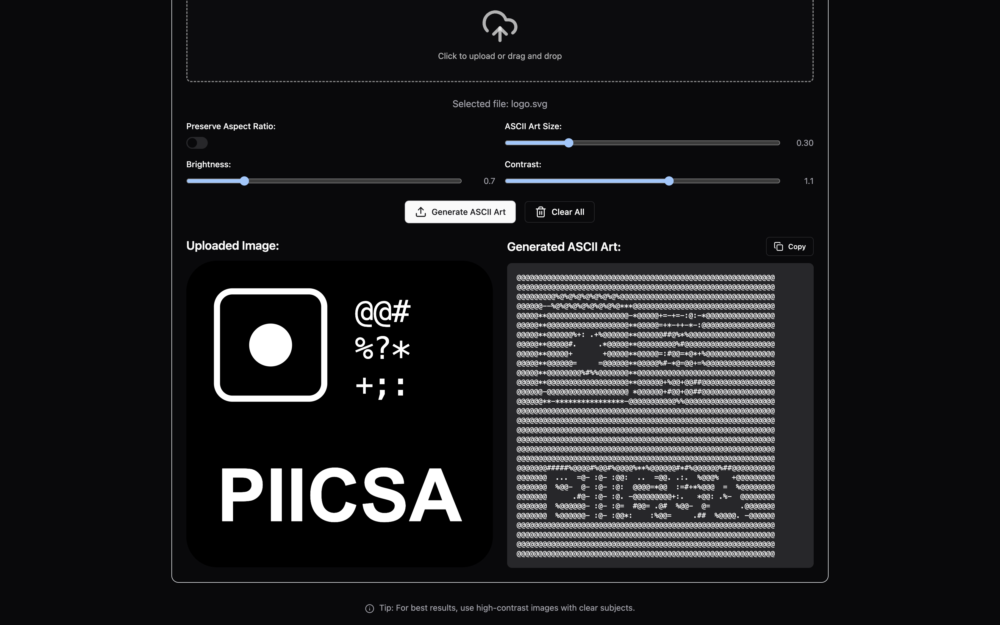

<div align="left">
  
</div>

# PIICSA - Picture to ASCII Art Generator

PIICSA (Picture Into Incredible ASCII art) is a web application that transforms images into ASCII art. This project allows users to upload images, adjust various parameters, and generate unique ASCII representations of their pictures.

## Preview

<div align="left">
  
</div>

## Features

- [x] Image to ASCII art conversion
- [x] Adjustable parameters:
  - Scale factor
  - Brightness
  - Contrast
  - Aspect ratio preservation
- [x] Real-time preview of uploaded image
- [x] Copy generated ASCII art to the clipboard
- [x] Responsive design for both desktop and mobile devices
- [x] Dark and light mode support
- [ ] Create NFT of the **ASCII ART**

## Technologies Used

- React
- TypeScript
- Vite
- Tailwind CSS
- shadcn/ui components

## Local Setup

To set up PIICSA locally, follow these steps:

1. Clone the repository:

   ```bash
   git clone https://github.com/sanketnighot/piicsa.git
   cd piicsa
   ```

2. Install dependencies:

   ```bash
   pnpm install
   ```

3. Start the development server:

   ```bash
   pnpm run dev
   ```

4. Open your browser and navigate to `http://localhost:5173` (or the port shown in your terminal).

## Usage

1. Upload an image by clicking on the upload area or dragging and dropping a file.
2. Adjust the settings as desired:
   - Toggle "Preserve Aspect Ratio" to maintain or alter the image's original proportions.
   - Use the sliders to adjust the ASCII art size, brightness, and contrast.
3. Click the "Generate ASCII Art" button to create your ASCII representation.
4. Once generated, you can copy the ASCII art to your clipboard using the "Copy" button.

## Building for Production

To create a production build, run:

```bash
pnpm run build
```
